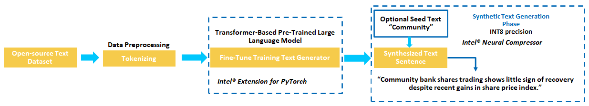

# Text Data Generation

## Introduction

This reference kit highlights how the [Intel® AI Tools](https://www.intel.com/content/www/us/en/developer/tools/oneapi/ai-analytics-toolkit.html) can be used to generate a Machine Learning (ML) application from PyTorch-based Large Language Models (LLMs). It generates domain specific synthetic news headlines using a Generative Pre-trained Transformer 2 (GPT2) fine-tuned model.

Check out more workflow examples in the [Developer Catalog](https://developer.intel.com/aireferenceimplementations).

## Solution Technical Overview

[Synthetic data](https://en.wikipedia.org/wiki/Synthetic_data) is information that's artificially generated rather than produced by real-world events.
Businesses can benefit from synthetic data for privacy issues, faster product testing turnaround and training machine learning algorithms. Most data privacy rules limit how organizations handle sensitive data. Any leaking or disclosure of personally identifiable consumer information can result in costly litigation that harms the brand's reputation. As a result, avoiding privacy issues is the primary reason why businesses engage in synthetic data-generating technologies.

Data is frequently unavailable for completely new goods. Furthermore, human-annotated data is an expensive and time-consuming procedure. This may be avoided if businesses invest in synthetic data, which can be created quickly and aid in the development of solid machine learning models. The text generation model will be built by using a pre-trained GPT2 model provided by the HuggingFace* `transformers` package and implemented in PyTorch*. To focus the model on the task of generating similar headlines, it will be fine-tuned on a headline dataset specified below. Once the model is fine-tuned, it will be used for generating new pieces of data that look and feel similar to the provided dataset without being exactly the same.

There are many ways of building a text generation system. This implementation will follow a state-of-the-art approach using a pre-trained language model for text generation, and fine-tuning it with a news headline dataset using the Causal Language Model formulation. This will refine the model to generate similar text compared to the source dataset. The chosen pre-trained model is `gpt2-medium` provided by the HuggingFace* `transformers` project, though many other models can be used.

For larger and more powerful systems, more modern, but expensive pre-trained Large Language Models can be used to improve performance. For example, [gpt-j-6B](https://huggingface.co/EleutherAI/gpt-j-6B) is a 6B parameter open-source implementation of a smaller GPT3 model, trained on a [publicly available dataset](https://huggingface.co/datasets/the_pile). However, use of this model requires [at least 48GB of CPU RAM to run the model in full precision](https://huggingface.co/docs/transformers/v4.14.1/en/model_doc/gptj#gptj).

Intel® Extension for PyTorch* and Intel® Neural Compressor are used to optimize this pipeline for better performance:

- [Intel® Extension for PyTorch*](https://github.com/intel/intel-extension-for-pytorch) extends PyTorch* with up-to-date features optimizations for an extra performance boost on Intel hardware. Optimizations take advantage of AVX-512 Vector Neural Network Instructions (AVX512 VNNI) and Intel® Advanced Matrix Extensions (Intel® AMX) on Intel CPUs as well as Intel Xe Matrix Extensions (XMX) AI engines on Intel discrete GPUs. Moreover, through PyTorch* xpu device, Intel® Extension for PyTorch* provides easy GPU acceleration for Intel discrete GPUs with PyTorch*.
- [Intel® Neural Compressor](https://www.intel.com/content/www/us/en/developer/tools/oneapi/neural-compressor.html) performs model compression to reduce the model size and increase the speed of deep learning inference for deployment on CPUs or GPUs. This open source Python* library automates popular model compression technologies, such as quantization, pruning, and knowledge distillation across multiple deep learning frameworks.

## Solution Technical Details

### Dataset

The dataset used in this reference kit is taken from [Kaggle](https://www.kaggle.com/datasets/therohk/million-headlines).

It consists of 1,048,576 rows of news headlines sourced from the reputable Australian news source ABC (Australian Broadcasting Corporation), where each row in the dataset represents a news headline with fields:

- **publish_date**: Date of publishing for the article in YYYYMMDD format
- **headline_text**: Text of the headline in ASCII (American Standard Code for Information Interchange), English, lowercase

For the task of text generation **publish_date** is ignored and the **headline_text** field is used to train each of the model to generate novel news headlines similar to the source text.

For development, 5000 samples from the million news headlines dataset are considered since they represent the majority of the context information in the current dataset and also because of the computing effort associated with the experiment.

| **Use case** | AI Unstructured Synthetic Text Data Generation
| :--- | :---
| **Size** | Total 1.04 Million rows of headlines, Initial 5000 rows used for development
| **Source** | https://www.kaggle.com/datasets/therohk/million-headlines

>Note: See the dataset applicable license for terms and conditions. Intel® Corporation does not own the rights to this dataset and does not confer any rights to it.

## Validated Hardware Details

[Intel® oneAPI](https://www.intel.com/content/www/us/en/developer/tools/oneapi/overview.html) is used to achieve quick results even when the data for a model is huge. It provides the capability to reuse the code present in different languages so that the hardware utilization is optimized to provide these results.

| Recommended Hardware                                            | Precision
| --------------------------------------------------------------- | ------------
| CPU: Intel® 2nd Gen Xeon® Platinum 8280 CPU @ 2.70GHz or higher | FP32, BF16, INT8
| RAM: 187 GB                                                     |
| Recommended Free Disk Space: 20 GB or more                      |

Code was tested on Ubuntu\* 22.04 LTS.

## How it Works

### Use Case End-To-End Workflow



The workflow pipeline follows these steps:

   1. Use the pre-trained tokenizers for `gpt2-medium` to do tokenization.
   2. Perform fine-tuning training on the pre-trained `gpt2-medium` model using our dataset and the Causal Language Modeling objective.
   3. Generate new headlines based on either a seed text or from scratch using the fine-tuned model.

The tokenization step for data-preprocessing is automatically done within the provided scripts and utilities using the `transformers` package.

#### Expected Input-Output

|   **Input**    | **Output** |
|:---------------:| :---: |
| Optional Context |  Unstructured text headline generated ("Alp Claims 10 point lead after victory over London Greens.")

## Get Started

Start by **defining an environment variable** that will store the workspace path, this can be an existing directory or one to be created in further steps. This ENVVAR will be used for all the commands executed using absolute paths.

[//]: # (capture: baremetal)
```bash
export WORKSPACE=$PWD/text-data-generation
```

Define `DATA_DIR`, `CONFIG_DIR` and `OUTPUT_DIR` as follows:

[//]: # (capture: baremetal)
```bash
export DATA_DIR=$WORKSPACE/data
export OUTPUT_DIR=$WORKSPACE/output
export CONFIG_DIR=$WORKSPACE/configs
```

### Download the Workflow Repository

Create a working directory for the workflow and clone the [Text Data Generation](https://www.github.com/oneapi-src/text-data-generation) repository into your working directory.

[//]: # (capture: baremetal)
```bash
mkdir -p $WORKSPACE && cd $WORKSPACE
```

```bash
git clone https://www.github.com/oneapi-src/text-data-generation.git $WORKSPACE
```

[//]: # (capture: baremetal)
```bash
mkdir -p $DATA_DIR $OUTPUT_DIR/models
```

### Set Up Conda

To learn more, please visit [install anaconda on Linux](https://docs.anaconda.com/free/anaconda/install/linux/).
```bash
wget https://repo.anaconda.com/miniconda/Miniconda3-latest-Linux-x86_64.sh
bash Miniconda3-latest-Linux-x86_64.sh
rm Miniconda3-latest-Linux-x86_64.sh
```

### Set Up Environment

The conda yaml dependencies are kept in `$WORKSPACE/env/intel_env.yml`.

| **Packages required in YAML file:**                 | **Version:**
| :---                          | :--
| python  | 3.9
| intel-extension-for-pytorch | 2.0.100
| neural-compressor | 2.3.1
| numpy | 1.24.3
| pandas | 1.5.3
| kaggle | 1.5.16
| pip | 23.3.1
| datasets | 2.16.0
| accelerate | 0.25.0
| transformers | 4.26.0
| optimum[onnxruntime] | 1.6.4
| onnxruntime | 1.16.3

Follow the next steps for Intel® Python* Distribution setup inside conda environment:

```bash
# If you have conda 23.10.0 or greater you can skip the following two lines
# since libmamba is already set as the default solver.
conda install -n base conda-libmamba-solver -y
conda config --set solver libmamba
conda env create -f $WORKSPACE/env/intel_env.yml
```

Environment setup is required only once.  Make sure no conda environment exists with the same name since this step does not cleanup/overwrite the existing environment. During this setup a new conda environment will be created with the dependencies listed in the YAML file.

Once the appropriate environment is created it has to be activated using the conda command as given below:

```bash
conda activate text_generation_intel
```

### Download the Datasets

A Kaggle* account is necessary to use the Kaggle* CLI. Instructions can be found at [Kaggle* api website](https://github.com/Kaggle/kaggle-api).

Within this process, an `API Token File` will be created and as consequence, a json file named `kaggle.json` will be downloaded. That json file should be stored in a `.kaggle` folder that should be created by the user (usually in the home folder).

If you are behind a proxy, the `kaggle.json` file can be modified to add it. An example is shown as follows:

```json
{"username":"your_user","key":"your_key","proxy":"your_proxy"}
```

Where `your_user` and `your_key` were previously generated by Kaggle*. You should replace `your_proxy` with you proxy ip address.

To setup the data for benchmarking under these requirements, run the following set of commands:

```bash
cd $DATA_DIR
kaggle datasets download -d therohk/million-headlines
unzip million-headlines.zip
rm million-headlines.zip
```

The following transformations are automatically done when using the [finetune_model.py](#run-workflow) script below:

1. To each headline, the phrase "|HEADLINE| " is prepended.  This allows for more direct generation of headlines without the need for of an explicit seed text.  This introduction of baseline text which informs the language model with more specifics about what to generate is known as *prompting*.
2. To each headline, we attach the "." token to allow for the model to learn to naturally generate endings for valid headlines.

## Supported Runtime Environment

You can execute the references pipelines using the following environments:

- Bare Metal

---

### Run Using Bare Metal

#### Set Up System Software

Our examples use the `conda` package and environment on your local computer. If you don't already have `conda` installed or the `conda` environment created, go to [Set Up Conda*](#set-up-conda) or see the [Conda* Linux installation instructions](https://docs.conda.io/projects/conda/en/stable/user-guide/install/linux.html).

#### Apply patch for XPU

If the user wants to use GPU, the following steps must be followed:

1. Follow the instructions in [Set Up Environment](#set-up-environment) but use `intel_env_xpu.yml` instead of `intel_env.yml`.
2. Activate conda environment:

```bash
conda activate text_generation_xpu_intel
```

3. Apply patch:

```bash
cd $WORKSPACE/src
python apply_xpu_patch.py
```

4. Follow the instructions described in [Run Workflow](#run-workflow).

5. Once the user wants to remove the environment run:

```bash
conda activate base
conda env remove -n text_generation_xpu_intel
```

### Run Workflow

#### Setting correct locations inside config files

Before running the scripts, the paths to the prompt file and models need to be set inside the config files. It can be set manually by configuring the different variables inside `$CONFIG_DIR/config_base.yml`, `$CONFIG_DIR/config_finetuned_inc.yml` and `$CONFIG_DIR/config_finetuned_intel.yml` (see [Configuration Parameters](#configuration-parameters)). For this reference kit use the following commands to do it automatically.

[//]: # (capture: baremetal)
```bash
sed -i "s|prompt_file:.*|prompt_file: $CONFIG_DIR/prompt.csv|g" $CONFIG_DIR/config_base.yml
sed -i -e "s|prompt_file:.*|prompt_file: $CONFIG_DIR/prompt.csv|g" -e "s|path:.*|path: $OUTPUT_DIR/models/gpt2-medium-finetuned-inc-onnx|g" $CONFIG_DIR/config_finetuned_inc.yml
sed -i -e "s|prompt_file:.*|prompt_file: $CONFIG_DIR/prompt.csv|g" -e "s|path:.*|path: $OUTPUT_DIR/models/gpt2-medium-finetuned-intel-onnx|g" $CONFIG_DIR/config_finetuned_intel.yml
```

##### **Configuration Parameters**

Within the yaml configuration files, the following optional arguments can be specified:

`prompt_file`: A prompt file can be provided using the `prompt_file` argument to generate headlines that start with a certain phrase. For example, the file `prompt.csv`, which is included in this repo for demo purposes, can be

```csv
Community
Farmers
```

which will ask the script to generate 2 sets of headlines, one starting with "Community" and the other starting with "Farmers". Not providing a prompt file will generate headlines starting with anything.

`min_length`: The `min_length` argument will force the model to output a body of text that has at least `min_length` number of tokens, excluding the ".". However, based on the training data, this can lead to non-sensical generation.  For example, for our model and data, headlines are rather short, so after a certain length, the model generates nonsense.  This can be post-processed at the users discretion.

`max_length_buffer`: The `max_length_buffer` argument limits the max length of the generated text to be `max_length = min_length + max_length_buffer`.

#### Training the model

The `finetune_model.py` script can be used to fine-tune a pre-trained `transformers` model using the prepared dataset with the aforementioned prompt.  This trains the model using the Causal Language Modeling objective which is a key component for the model to naturally learn to generate text. The following command downloads a pre-trained `gpt2-medium` model from the `transformers` hub and fine-tunes it on the dataset. The optional `--bfloat16` flag reduces the precision to `bfloat16` (check if CPU is capable of using `bfloat16` data type).

```txt
usage: finetune_model.py [-h] --model_config MODEL_CONFIG --data_path DATA_PATH --save_path SAVE_PATH [--num_epochs NUM_EPOCHS] [--lr LR] [--bfloat16]

optional arguments:
  -h, --help            show this help message and exit
  --model_config MODEL_CONFIG
                        yaml configuration file for model.
  --data_path DATA_PATH
                        path to the "ABC million news headlines" csv.
  --save_path SAVE_PATH
                        path to save the model.
  --num_epochs NUM_EPOCHS
                        number of epochs to train the model. Defaults to 3.
  --lr LR               learning rate for training. Defaults to 5e-5.
  --bfloat16            use bfloat16 for training. Defaults to False.

```

The command to fine-tune the model is:

[//]: # (capture: baremetal)
```bash
ipexrun --use_logical_core --enable_tcmalloc $WORKSPACE/src/finetune_model.py --model_config $CONFIG_DIR/config_base.yml --data_path $DATA_DIR/abcnews-date-text.csv --save_path $OUTPUT_DIR/models/gpt2-medium-finetuned-intel
```

#### Converting the saved model to ONNX to optimize runtime

Before this pre-trained model is used to generate text, we will first use the `optimum` package and command line tool to convert the format of the saved model to ONNX format. This allows it to be used by multiple accelerators and generally speeds up execution time. The below command can be used to convert the saved model above to an ONNX format to be used in the generation script with the provided `$CONFIG_DIR/config_finetuned_intel.yml` model config. Along with accelerating execution time, the ONNX format also enables full use of the next quantization step from Intel® Neural Compressor.

[//]: # (capture: baremetal)
```bash
optimum-cli export onnx --model $OUTPUT_DIR/models/gpt2-medium-finetuned-intel --task causal-lm $OUTPUT_DIR/models/gpt2-medium-finetuned-intel-onnx
```

>**Note:**
> When running the ONNX conversion using optimum, the following error may be displayed during the validation step
>  ```txt
>  Validating ONNX model...
>  An error occurred with the error message: 'tuple' object has no attribute 'items'.
>  The exported model was saved at: saved_models/gpt2-medium-finetuned-stock-onnx
>  ```
>  If this occurs, please proceed as normal. Although unable to be validated, the ONNX model is still successfully saved and can be used normally.
> 

The converted ONNX fine-tuned model will be saved to `$OUTPUT_DIR/models/gpt2-medium-finetuned-stock-onnx`.

#### Text Generation from the Fine-tuned Model

Using the fine-tuned model to generate new text can be done using the `generate_text.py` script. This takes in a pre-trained ONNX format model and generates similar entries to the dataset using a generation config file, provided by default here as `$CONFIG_DIR/config_finetuned_intel.yml`.

The arguments for the `generate_text.py` script are as follows:

```txt
usage: generate_text.py [-h] --model_config MODEL_CONFIG [--benchmark_mode] [--benchmark_seq_length BENCHMARK_SEQ_LENGTH]

optional arguments:
  -h, --help            show this help message and exit
  --model_config MODEL_CONFIG
                        yaml configuration file for model.
  --benchmark_mode      use intel pytorch extension to optimize model.
  --benchmark_seq_length BENCHMARK_SEQ_LENGTH
                        length of generation if benchmark mode is used.
```

The trained model can be used to generate text using the provided `generate_text.py` script as well as the provided configuration file `$CONFIG_DIR/config_finetuned_intel.yml`. An example command is:

[//]: # (capture: baremetal)
```bash
python $WORKSPACE/src/generate_text.py --model_config $CONFIG_DIR/config_finetuned_intel.yml
```

This will output a json string with the generated headlines.

#### Quantizing the Trained Models

Model Quantization is a way of optimizing the inference process of a trained model by converting weights and operations from FP32 precision to the much smaller INT8 precision. This can dramatically reduce the size of the model and computational cost of the model, leading to accelerated downstream performance. This process can be implemented using Intel® Neural Compressor, a library which offers multiple algorithms for compressing models to accelerate execution time, including Model Quantization.

For the fine-tuned model generated above, we will accelerate text generation time by quantizing the FP32 model to INT8 format using the *Accuracy Aware Dynamic Quantization* algorithm provided by Intel® Neural Compressor. The Accuracy Aware component automatically tunes the quantization procedure while also monitoring for potential accuracy losses due to changes in precision.

To do dynamic quantization of the above fine-tuned GPT2 model and save a new version that can be used within the above text generation script use `quantize_inc_gpt2.py`. Other pre-trained model architectures may require their own quantization script:

```txt
usage: quantize_inc_gpt2.py [-h] --model_config MODEL_CONFIG --save_model_dir SAVE_MODEL_DIR --data_path DATA_PATH

optional arguments:
  -h, --help            show this help message and exit
  --model_config MODEL_CONFIG
                        yaml configuration file for model.
  --save_model_dir SAVE_MODEL_DIR
                        directory to save the quantized model to.
  --data_path DATA_PATH
                        path to the "ABC million news headlines" csv.
```

A command to quantize the finetuned ONNX model, `$OUTPUT_DIR/models/gpt2-medium-finetuned-intel-onnx`, saving it in INT8 ONNX format at `$OUTPUT_DIR/models/gpt2-medium-finetuned-inc-onnx/` is:

[//]: # (capture: baremetal)
```bash
python $WORKSPACE/src/quantize_inc_gpt2.py --model_config $CONFIG_DIR/config_finetuned_intel.yml --save_model_dir $OUTPUT_DIR/models/gpt2-medium-finetuned-inc-onnx/ --data_path $DATA_DIR/abcnews-date-text.csv
```

Once the quantized model is created, we can use the `generate_text.py` script on the quantized model, using the `$CONFIG_DIR/config_finetuned_inc.yml` model config file:

[//]: # (capture: baremetal)
```bash
python $WORKSPACE/src/generate_text.py --model_config $CONFIG_DIR/config_finetuned_inc.yml
```

### Running a GPTJ-6B Model

GPT-J 6B is a transformer model trained using Ben Wang's [Mesh Transformer JAX](https://github.com/kingoflolz/mesh-transformer-jax/). "GPT-J" refers to the class of model, while "6B" represents the number of trainable parameters.

#### Inference

Run the `gptj_generate_text.py` script to generate text using the gpt-j-6B IR model:

```bash
usage: gptj_generate_text.py [-h] --prompt PROMPT [--max_new_tokens MAX_NEW_TOKENS] [--temperature TEMPERATURE]

optional arguments:
  -h, --help            show this help message and exit
  --prompt PROMPT, -p PROMPT
                        Prompt to be provided
  --max_new_tokens MAX_NEW_TOKENS
                        Maximum no. of new tokens to be generated. Default - 32
  --temperature TEMPERATURE
                        Temperature parameter for the GPT model. Default - 0.9
```

Example command:

[//]: # (capture: baremetal)
```bash
python $WORKSPACE/src/gptj_generate_text.py  --prompt "hello i am"
```

### Clean Up Bare Metal

Before proceeding to the cleaning process, it is strongly recommended to make a backup of the data that the user wants to keep. To clean the previously downloaded and generated data, run the following commands:

```bash
conda activate base
conda env remove -n text_generation_intel
```

```bash
rm -rf $DATA_DIR $OUTPUT_DIR
```

To remove WORKSPACE:

```bash
rm -rf $WORKSPACE
```

### Expected Output

A successful execution of `finetune_model.py` should return similar results as shown below:

```txt
...
Map: 100%|█████████████████████████████████████████████████████████████████████████████████████| 4000/4000 [00:00<00:00, 4252.59 examples/s]
Map: 100%|█████████████████████████████████████████████████████████████████████████████████████| 1000/1000 [00:00<00:00, 3381.15 examples/s]
huggingface/tokenizers: The current process just got forked, after parallelism has already been used. Disabling parallelism to avoid deadlocks...
To disable this warning, you can either:
        - Avoid using `tokenizers` before the fork if possible
        - Explicitly set the environment variable TOKENIZERS_PARALLELISM=(true | false)
huggingface/tokenizers: The current process just got forked, after parallelism has already been used. Disabling parallelism to avoid deadlocks...
To disable this warning, you can either:
        - Avoid using `tokenizers` before the fork if possible
        - Explicitly set the environment variable TOKENIZERS_PARALLELISM=(true | false)
huggingface/tokenizers: The current process just got forked, after parallelism has already been used. Disabling parallelism to avoid deadlocks...
To disable this warning, you can either:
        - Avoid using `tokenizers` before the fork if possible
        - Explicitly set the environment variable TOKENIZERS_PARALLELISM=(true | false)
/localdisk/aagalleg/miniconda3/envs/text_generation_intel/lib/python3.9/site-packages/intel_extension_for_pytorch/optim/_optimizer_utils.py:348: UserWarning: Does not suport fused step for <class 'torch.optim.adamw.AdamW'>, will use non-fused step
  warnings.warn("Does not suport fused step for " + str(type(optimizer)) + ", will use non-fused step")
  0%|                                                                                                              | 0/1500 [00:00<?, ?it/s]You're using a GPT2TokenizerFast tokenizer. Please note that with a fast tokenizer, using the `__call__` method is faster than using a method to encode the text followed by a call to the `pad` method to get a padded encoding.
{'loss': 3.7542, 'learning_rate': 4.795663052543787e-05, 'epoch': 1.0}                                                                      
{'loss': 2.8271, 'learning_rate': 4.587155963302753e-05, 'epoch': 2.0}                                                                      
{'loss': 2.2259, 'learning_rate': 4.378648874061718e-05, 'epoch': 3.0}                                                                      
{'train_runtime': 1423.8045, 'train_samples_per_second': 8.428, 'train_steps_per_second': 1.054, 'train_loss': 2.9357469075520832, 'epoch': 3.0}
100%|███████████████████████████████████████████████████████████████████████████████████████████████████| 1500/1500 [23:43<00:00,  1.05it/s]
Training time: 1423.8078002929688s
```

A successful execution of `optimum-cli` should return similar results as shown below:

```txt
...
Local PyTorch model found.
Framework not specified. Using pt to export to ONNX.
Using framework PyTorch: 2.0.1+cpu
Overriding 2 configuration item(s)
        - use_cache -> False
        - pad_token_id -> 0
/localdisk/aagalleg/miniconda3/envs/text_generation_intel/lib/python3.9/site-packages/transformers/models/gpt2/modeling_gpt2.py:807: TracerWarning: Converting a tensor to a Python boolean might cause the trace to be incorrect. We can't record the data flow of Python values, so this value will be treated as a constant in the future. This means that the trace might not generalize to other inputs!
  if batch_size <= 0:
============== Diagnostic Run torch.onnx.export version 2.0.1+cpu ==============
verbose: False, log level: Level.ERROR
======================= 0 NONE 0 NOTE 0 WARNING 0 ERROR ========================

Validating ONNX model...
An error occured with the error message: 'tuple' object has no attribute 'items'.
The exported model was saved at: saved_models/gpt2-medium-finetuned-intel-onnx
```

A successful execution of `quantize_inc_gpt2.py` should return similar results as shown below:

```txt
...
2023-12-27 16:42:07 [INFO] Tune 4 result is: [Accuracy (int8|fp32): 45.0290|44.8773, Duration (seconds) (int8|fp32): 9.7832|20.0922], Best tune result is: [Accuracy: 45.0290, Duration (seconds): 9.7832]
2023-12-27 16:42:07 [INFO] |**********************Tune Result Statistics**********************|
2023-12-27 16:42:07 [INFO] +--------------------+----------+---------------+------------------+
2023-12-27 16:42:07 [INFO] |     Info Type      | Baseline | Tune 4 result | Best tune result |
2023-12-27 16:42:07 [INFO] +--------------------+----------+---------------+------------------+
2023-12-27 16:42:07 [INFO] |      Accuracy      | 44.8773  |    45.0290    |     45.0290      |
2023-12-27 16:42:07 [INFO] | Duration (seconds) | 20.0922  |    9.7832     |     9.7832       |
2023-12-27 16:42:07 [INFO] +--------------------+----------+---------------+------------------+
2023-12-27 16:42:07 [INFO] [Strategy] Found a model that meets the accuracy requirements.
2023-12-27 16:42:07 [INFO] Save tuning history to /localdisk/aagalleg/frameworks.ai.platform.sample-apps.text-data-generation/nc_workspace/2023-12-27_16-38-24/./history.snapshot.
2023-12-27 16:42:07 [INFO] Specified timeout or max trials is reached! Found a quantized model which meet accuracy goal. Exit.
2023-12-27 16:42:07 [INFO] Save deploy yaml to /localdisk/aagalleg/frameworks.ai.platform.sample-apps.text-data-generation/nc_workspace/2023-12-27_16-38-24/deploy.yaml
```

A successful execution of `generate_text.py` should return similar results as shown below:

```txt
...
[{"sentences": ["Community experiences performance enhancing drug (PED) experiences."]}, {"sentences": ["Farmers pleased with figures."]}]
(text_generation_intel) 
```

A successful execution of `gptj_generate_text.py` should return similar results as shown below:

```txt
...
hello i am using this code to get the location name using latitude and longitude
```

## Summary and Next Steps

Synthetic Text Generators can be used for many purposes, including building intelligent chat bots and creating artificial data generators for calibrating models.  In this reference kit, we have demonstrated one approach to building a synthetic text generation model using a small pre-trained Transformer-based Large Language Model (LLM), `gpt-2`. By leveraging fine-tuning, we were able to orient the model to generate data that matched our dataset while also utilizing the knowledge it was pre-trained with.  This underlying solution powers many of the existing Large Language Model technologies seen today.

## Appendix

### Notices & Disclaimers

Performance varies by use, configuration, and other factors. Learn more on the [Performance Index site](https://edc.intel.com/content/www/us/en/products/performance/benchmarks/overview/).
Performance results are based on testing as of dates shown in configurations and may not reflect all publicly available updates.  See backup for configuration details.  No product or component can be secure.
Your costs and results may vary.
Intel technologies may require enabled hardware, software or service activation.
© Intel Corporation.  Intel, the Intel logo, and other Intel marks are trademarks of Intel Corporation or its subsidiaries.  Other names and brands may be claimed as the property of others.

To the extent that any public or non-Intel datasets or models are referenced by or accessed using tools or code on this site those datasets or models are provided by the third party indicated as the content source. Intel does not create the content and does not warrant its accuracy or quality. By accessing the public content, or using materials trained on or with such content, you agree to the terms associated with that content and that your use complies with the applicable license.

Intel expressly disclaims the accuracy, adequacy, or completeness of any such public content, and is not liable for any errors, omissions, or defects in the content, or for any reliance on the content. Intel is not liable for any liability or damages relating to your use of public content.

\*Other names and brands that may be claimed as the property of others. [Trademarks](https://www.intel.com/content/www/us/en/legal/trademarks.html).
