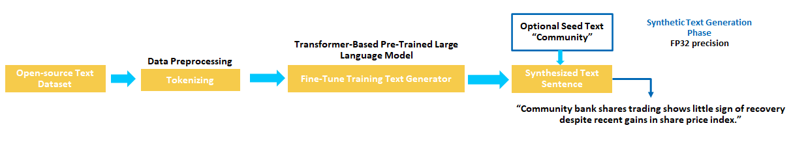
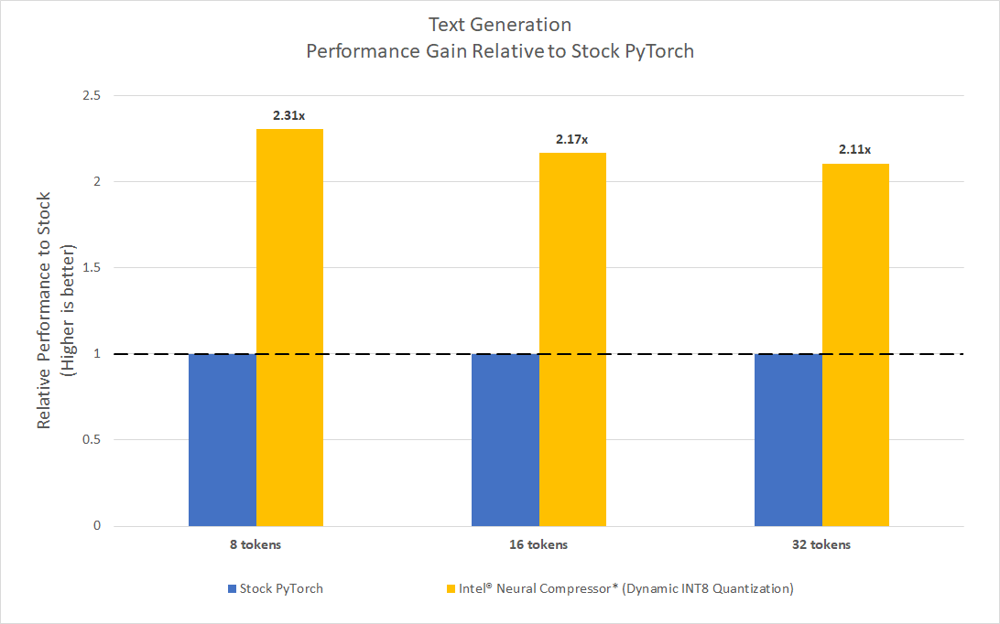

# Applications of AI Unstructured Synthetic Data Generation Using PyTorch

## Table of Contents 
 - [Purpose](#purpose)
 - [Unstructured Text Generation using Transformers](#unstructured-text-generation-using-transformer---reference-solution)
 - [Performance Observations](#performance-observations)
 - [Key Take Aways & Conclusion](#key-take-aways--conclusion)

## Purpose
Synthetic data is information that's artificially generated rather than produced by real-world events. [MORE INFO](https://en.wikipedia.org/wiki/Synthetic_data)

Businesses can benefit from synthetic data for privacy issues, faster product testing turnaround, and training machine learning algorithms. Most data privacy rules limit how organizations handle sensitive data. Any leaking or disclosure of personally identifiable consumer information can result in costly litigation that harms the brand's reputation. As a result, avoiding privacy issues is the primary reason why businesses engage in synthetic data-generating technologies. Data is frequently unavailable for completely new goods. Furthermore, human-annotated data is an expensive and time-consuming procedure. This may be avoided if businesses invest in synthetic data, which can be created fast and aid in the development of solid machine learning models.

This reference kit uses Intel® oneAPI to showcase one-way applications of PyTorch-based Large Language Models (LLMs) to produce synthetic news headlines similar to the training data.  Specifically, we demonstrate a reference implementation generating unstructured synthetic text data for news headlines using:

1. a Transformers based GPT2 model that is fine-tuned on the dataset to produce more domain specific relevant texts

## Key Implementation Details

The text generation model will be built by using a pre-trained GPT2 model provided by the HuggingFace `transformers` package and implemented in PyTorch.  To focus the model on the task of generating similar headlines, it will be fine tuned on a headline dataset that we specify below.  Once the model is fine-tuned, it will be used for generating new pieces of data that look and feel similar to the provided dataset without being exactly the same.

In this reference kit, we also highlight how the Intel® oneAPI AI Analytics Toolkit can be used to accelerate the computational speed of the model with a few additional steps.

## Unstructured Text Generation using Transformer - Reference Solution

There are many ways of building a text generation system. In this implementation, we will follow the SOTA approach of using a pre-trained language model for text generation, and fine-tuning it with our news headline dataset using the Causal Language Model formulation.  This will refine the model to generate text similar to our source dataset.  The pre-trained model we choose is the popular `gpt2-medium` provided by the HuggingFace `transformers` project though many other models can be used.  

For larger and more powerful systems, more modern, but expensive pre-trained Large Language Models models can be used to improve performance.  For example, `[gpt-j-6B](https://huggingface.co/EleutherAI/gpt-j-6B)` is a 6B parameter open-source implementation of a smaller GPT3 model, trained on a [publicly available dataset](https://huggingface.co/datasets/the_pile).  However, use of this model requires [at least 48GB of CPU RAM to run the model in full precision.](https://huggingface.co/docs/transformers/v4.14.1/en/model_doc/gptj#gptj)

Our pipeline to build this system will take these steps:

   1. use the pre-trained tokenizers for `gpt2-medium` to do tokenization
   2. perform fine-tuning training on the pre-trained `gpt2-medium` model using on our dataset and the Causal Language Modeling objective
   3. generate new headlines based on either a seed text or from scratch using the fine-tuned model

The tokenization step for data-preprocessing is automatically done within the provided scripts and utilities using the `transformers` package.

### Use Case End-To-End Flow 



### Expected Input-Output

|   **Input**    | **Output** |
|:---------------:| :---: |
| Optional Context |  Unstructured text headline generated ("Alp Claims 10 point lead after victory over London Greens.")

### Software Requirements

1. Python
2. PyTorch v1.13

To run this reference kit, first clone this repository, which can be done using

```shell
git clone https://www.github.com/oneapi-src/text-data-generation
cd text-data-generation
```

> **Note**: If you wish to explore the reference kits on machines using Windows, first go to the [Running on Windows](#running-on-windows) section to ensure that WSL and your machine is setup, then return here.

> **Note**: The performance measurements were captured on Xeon based processors. The instructions will work on WSL, however some portions of the ref kits may run slower under that setup. Additionally performance claims reported may not be seen on a Windows based client machine.

This reference kit implementation already provides the necessary scripts to setup the above software requirements. To utilize these environment scripts, first install Anaconda/Miniconda by following the instructions at

https://docs.conda.io/projects/conda/en/latest/user-guide/install/index.html

### Reference Solution Setup

Follow the below conda installation commands to setup the Stock PyTorch environment for the model training and text generation. 

```sh
conda env create -f env/stock/text-stock-torch.yml
```

*Activate stock conda environment*
Use the following command to activate the environment that was created:
```sh
conda activate text-stock-torch
```

This script utilizes the dependencies found in the `env/stock/text-stock-torch.yml` file to create an environment as follows:

|     **YAML file**     | **Environment Name** |        **Configuration**        |
| :-------------------: | :------------------: | :-----------------------------: |
| `env/stock/text-stock-torch.yml` |     `text-stock-torch`      | Python=3.9.x with PyTorch v1.13 |

For the workload implementation to arrive at first level reference solution we will be using the stock environment.

### Dataset

The dataset used in this reference kit is taken from [Kaggle](https://www.kaggle.com/datasets/therohk/million-headlines) 

It consists of 1048576 rows of news headlines sourced from the reputable Australian news source ABC (Australian Broadcasting Corporation), where each row in the data set represents a news headline with fields,

- **publish_date**: Date of publishing for the article in YYYYMMDD format
- **headline_text**: Text of the headline in Ascii, English, lowercase

For the task of text generation we ignore the **publish_date** and use the **headline_text** field to train each of the model to generate novel news headlines similar to the source text. 

For development, 5000 samples from the million news headlines dataset are considered since they represent the majority of the context information in the current dataset and also because of the computing effort associated with the experiment.

| **Use case** | AI Unstructured Synthetic Text Data Generation
| :--- | :---
| **Size** | Total 1.04 Million rows of headlines, Initial 5000 rows used for development<br>
| **Source** | https://www.kaggle.com/datasets/therohk/million-headlines

**Please refer to the data.txt file in the data folder for downloading the dataset.**

> ***Please see this data set's applicable license for terms and conditions. Intel®Corporation does not own the rights to this data set and does not confer any rights to it.***

### Reference Implementation

#### Data Preparation

Assuming the dataset has been downloaded and placed in the correct place as specified above, we will first prepare the dataset for use in fine-tuning the selected GPT-2 model on our task.  This will be done by using the default pre-processors and tokenizers for 'gpt2-medium' and adding a few additional steps to improve the models performance and usability.  Specifically, we do the following transformations to the data before training:

1. To each headline, the phrase "|HEADLINE| " is prepended.  This allows for more direct generation of headlines without the need for of an explicit seed text.  This introduction of baseline text which informs the language model with more specifics about what to generate is known as *prompting*.
2. To each headline, we attach the "." token to allow for the model to learn to naturally generate endings for valid headlines.

These are automatically done when using the training script below.

#### Training the model

The `finetune_model.py` script can be used to fine-tune a pre-trained `transformers` model using the prepared dataset with the aforementioned prompt.  This trains the model using the Causal Language Modeling objective which is a key component for the model to naturally learn to generate text.

```
usage: finetune_model.py [-h] --model_config MODEL_CONFIG --data_path DATA_PATH --save_path SAVE_PATH [--num_epochs NUM_EPOCHS] [--lr LR] [--intel]
                         [--bfloat16]

optional arguments:
  -h, --help            show this help message and exit
  --model_config MODEL_CONFIG
                        yaml configuration file for model.
  --data_path DATA_PATH
                        path to the "ABC million news headlines" csv.
  --save_path SAVE_PATH
                        path to save the model.
  --num_epochs NUM_EPOCHS
                        number of epochs to train the model. Defaults to 3.
  --lr LR               learning rate for training. Defaults to 5e-5.
  --intel               use intel pytorch extension to optimize model. Defaults to False.
  --bfloat16            use bfloat16 for training. Defaults to False.

```

The following command downloads a pre-trained `gpt2-medium` model from the `transformers` hub and fine-tunes it on the dataset, saving the newly trained model to the `saved_models/gpt2-medium-finetuned-stock` directory.

```sh
python src/finetune_model.py --model_config configs/config_base.yml --data_path data/abcnews-date-text.csv --save_path saved_models/gpt2-medium-finetuned-stock
```

**Expected Output**<br>
The output-trained model will be saved as a `huggingface` pre-trained model for PyTorch to `saved_models/gpt2-medium-finetuned-stock`.

#### Converting the saved model to ONNX to optimize runtime

Before this pre-trained model is used to generate text, we will first use the `optimum` package and command line tool to convert the format of the saved model to ONNX format.  This allows it to be used by multiple accelerators and generally speeds up execution time.  The below command can be used to convert the saved model above to an ONNX format to be used in the generation script with the provided `config/config_finetuned.yml` model config.

```
optimum-cli export onnx --model saved_models/gpt2-medium-finetuned-stock --task causal-lm saved_models/gpt2-medium-finetuned-stock-onnx
```

>**Note:**
> When running the ONNX conversion using optimum, the following error may be displayed during the validation step
>  ```
>  Validating ONNX model...
>  An error occured with the error message: 'tuple' object has no attribute 'items'.
>  The exported model was saved at: saved_models/gpt2-medium-finetuned-stock-onnx
>  ```
>  If this occurs, please proceed as normal. Although unable to be validated, the ONNX model is still successfully saved and can be used normally.
> 
**Expected Output**<br>
The converted ONNX fine-tuned model will be saved to `saved_models/gpt2-medium-finetuned-stock-onnx`.


#### Text Generation from the Fine-tuned Model

Using the fine-tuned model to generate new text can be done using the `generate_text.py` script. This takes in a pre-trained ONNX format model and generates similar entries to the dataset using a generation config file, provided by default here as `configs/config_finetuned.yml`. 

The arguments for the `generate_text.py` script are as follows:

```
usage: generate_text.py [-h] --model_config MODEL_CONFIG [--benchmark_mode] [--benchmark_seq_length BENCHMARK_SEQ_LENGTH]

optional arguments:
  -h, --help            show this help message and exit
  --model_config MODEL_CONFIG
                        yaml configuration file for model.
  --benchmark_mode      use intel pytorch extension to optimize model.
  --benchmark_seq_length BENCHMARK_SEQ_LENGTH
                        length of generation if benchmark mode is used.
```

**Configuration Parameters**

Within the yaml configuration file, the following optional arguments can be specified:

  `prompt_file`:
  
    A prompt file can be provided using the `prompt_file` argument to generate headlines that start with a certain phrase.  For example, the file "prompt.csv", which is included in this repo for demo purposes, can be

    ```csv
    Community
    Farmers
    ```

    which will ask the script to generate 2 sets of headlines, one starting with "Community" and the other starting with "Farmers".  Not providing a prompt file will generate headlines starting with anything.

  `min_length`:
  
    The `min_length` argument will force the model to output a body of text that has at least `min_length` number of tokens, excluding the ".".  
    
    However, based on the training data, this can lead to non-sensical generation.  For example, for our model and data, headlines are rather short, so after a certain length, the model generates nonsense.  This can be post-processed at the users discretion.
  
  `max_length_buffer`:

    The `max_length_buffer` argument limits the max length of the generated text to be `max_length = min_length + max_length_buffer`.

  An example command to use the finetuned `saved_models/gpt2-medium-finetuned-stock` model from the training script above and generate 2 headlines per prompt in the `prompt.csv` with a minimum length of 10 tokens and max length of 20 tokens is:

  ```sh 
  python src/generate_text.py --model_config configs/config_finetuned.yml
  ```

  which will output a json string with the generated headlines.

## Optimizing the End-to-End solution with Intel® oneAPI components

### Use Case End-To-End flow


### Intel® oneAPI Optimized software requirements

| **Package**                | **Intel® Python**                   
| :---                       | :---                               
| Python                     | python=3.9.7
| PyTorch                    | torch=1.13
| Intel® Extension For PyTorch | intel_extension_for_pytorch=1.13.0
| Intel® Neural Compressor  | neural-compressor==2.0.0

**YAML file**                                 | **Environment Name** |  **Configuration** |
| :---: | :---: | :---: |
`env/intel/text-intel-torch.yml`             | `text-intel-torch` | Python=3.9.7, PyTorch v1.13, Intel® Extension for PyTorch v1.13, Intel® Neural Compressor v2.0.0 |

### Optimized Solution Setup

Follow the below conda installation commands to setup the Intel® oneAPI optimized PyTorch environment for model training and text generation. 

```sh
conda env create -f env/intel/text-intel-torch.yml
```

*Activate stock conda environment*
Use the following command to activate the environment that was created:
```sh
conda activate text-intel-torch
```

This script utilizes the dependencies found in the `env/intel/text-intel-torch.yml` file to create an environment as follows:

|     **YAML file**     | **Environment Name** |        **Configuration**        |
| :-------------------: | :------------------: | :-----------------------------: |
| `env/intel/text-intel-torch.yml` |     `text-intel-torch`      | Python=3.9.x with PyTorch v1.13, Intel® Extension For PyTorch v 1.13.0, Intel® Neural Compressor v2.0.0 |

### Intel® oneAPI Optimized Implementation

#### Optimizing the Training with the ***Intel® Extension for PyTorch*** 

**Data preparation is identical to the stock implementation.  Please refer to the previous section if this has not been done yet.**

We can optimize the fine-tuning speed for certain Intel® architectures by using the same `finetune_model.py` script and toggling the `--intel` flag.  This enables optimization using the ***Intel® Extension for PyTorch*** with the optional `--bfloat16` flag to reduce the precision.

**Intel® Extension for PyTorch**

The Intel® Extension for PyTorch* extends PyTorch with optimizations for an extra performance boost on Intel® hardware. Most of the optimizations will be included in stock PyTorch releases eventually, and the intention of the extension is to deliver up-to-date features and optimizations for PyTorch on Intel® hardware, examples include AVX-512 Vector Neural Network Instructions (AVX512 VNNI) and Intel® Advanced Matrix Extensions (Intel® AMX).

The command to fine-tune the model with Intel® optimizations enabled is:

```sh
ipexrun --use_logical_core --enable_tcmalloc src/finetune_model.py --model_config configs/config_base.yml --data_path data/abcnews-date-text.csv --save_path saved_models/gpt2-medium-finetuned-intel --intel
```

**Expected Output**<br>
The output-trained model will be saved as a `huggingface` pre-trained model saved to the 'saved_models/gpt2-medium-finetuned-intel'. Training time in seconds would be generated at the end of the training module.

#### Converting the saved model to ONNX to optimize runtime

We will once again use the `optimum` package and command line tool to convert the format of the saved model to ONNX format.  Along with accelerating execution time, the ONNX format also enables full use of the next quantization step from ***Intel® Neural Compressor***.  The below command can be used to convert the saved model above to an ONNX format

```
optimum-cli export onnx --model saved_models/gpt2-medium-finetuned-intel --task causal-lm saved_models/gpt2-medium-finetuned-intel-onnx
```

>**Note:**
> When running the ONNX conversion using optimum, the following error may be displayed during the validation step
>  ```
>  Validating ONNX model...
>  An error occured with the error message: 'tuple' object has no attribute 'items'.
>  The exported model was saved at: saved_models/gpt2-medium-finetuned-intel-onnx
>  ```
>  If this occurs, please proceed as normal. Although unable to be validated, the ONNX model is still successfully saved and can be used normally.

As above, this trained model can be used to generate text using the provided `generate_text.py` script as well as the provided configuration file `config/config_finetuned_intel.yml`.  An example command is

```sh
python src/generate_text.py --model_config configs/config_finetuned_intel.yml
```

**Expected Output**<br>
The converted ONNX fine-tuned model will be saved to `saved_models/gpt2-medium-finetuned-intel-onnx`.

#### Quantizing the Trained Models

Model Quantization is a way of optimizing the inference process of a trained model by converting weights and operations from FP32 precision to the much smaller INT8 precision.  This can dramatically reduce the size of the model and computational cost of the model, leading to accelerated downstream performance.  This process can be implemented using ***Intel® Neural Compressor***, a library which offers multiple algorithms for compressing model to accelerate execution time, including Model Quantization.

**Intel® Neural Compressor**

Intel® Neural Compressor is an open-source Python* library designed to help you quickly deploy low-precision inference solutions on popular Deep Learning frameworks such as TensorFlow*, PyTorch*, MXNet*, and ONNX* (Open Neural Network Exchange) runtime. The tool automatically optimizes low-precision recipes for Deep Learning models to achieve optimal product objectives, such as inference performance and memory usage, with expected accuracy criteria.

For the fine-tuned model generated from above, we will accelerate text generation time by quantizing the FP32 model to INT8 format using the *Accuracy Aware Dynamic Quantization* algorithm provided by ***Intel® Neural Compressor***.  The Accuracy Aware component automatically tunes the quantization procedure while also monitoring for potential accuracy losses due to changes in precision.  

We provide the `quantize_inc_gpt2.py` script to do dynamic quantization of the above fine-tuned GPT2 model and save a new version that can be used within the above text generation script.  Other pre-trained model architectures may require their own quantization script: 

```
usage: quantize_inc_gpt2.py [-h] --model_config MODEL_CONFIG --save_model_dir SAVE_MODEL_DIR --data_path DATA_PATH

optional arguments:
  -h, --help            show this help message and exit
  --model_config MODEL_CONFIG
                        yaml configuration file for model.
  --save_model_dir SAVE_MODEL_DIR
                        directory to save the quantized model to.
  --data_path DATA_PATH
                        path to the "ABC million news headlines" csv.

```

A command to quantize the finetuned ONNX model, `saved_models/gpt2-medium-finetuned-intel-onnx`, saving it in INT8 ONNX format at `saved_models/gpt2-medium-finetuned-inc-onnx/` is

```sh
python src/quantize_inc_gpt2.py --model_config configs/config_finetuned_intel.yml --save_model_dir saved_models/gpt2-medium-finetuned-inc-onnx/ --data_path data/abcnews-date-text.csv
```
Once the quantized model is created, we can use the `generate_text.py` script on the quantized model, using the `configs/config_finetuned_inc.yml` model config file:

```sh
python src/generate_text.py --model_config configs/config_finetuned_inc.yml
```

## Performance Observations

In the following, we report some results comparing Intel® technologies vs the stock alternative on the task of generating new texts of various lengths.  

### Text Generation to a Fixed Token Length

In this experiment, we fix the number of tokens to generate and evaluate the total amount of time take in model calls to generate all of the necessary tokens.  For text generation, we use a greedy decoding algorithm but only count the amount of time taken by calls to the model.  

We conduct benchmarks comparing the stock model converted to ONNX in FP32 format vs the intel model converted to ONNX and quantized using Intel® Neural Compressor with Accuracy Aware Dynamic Quantization.  The accuracy metric used for this was perplexity and the final model tested after quantization had a 3% higher perplexity compared to the original model.  

### Results Summary

### Text Generation to a Fixed Token Length



Using Dynamic INT8 Quantization on the fine-tuned model showed up to a 2.3x boost in text generation for generating an 8 token document and up to a 2.11x boost in text generation for generating a 32 token body.

## Key Take Aways & Conclusion

Synthetic Text Generators can be used for many purposes, including building intelligent chat bots and generating artificial data generators for calibrating models.  In this reference kit, we have demonstrated one approach to building a synthetic text generation model using a small pre-trained Transformer-based Large Language Model (LLM), `gpt-2`.  By leveraging fine-tuning, we were able to orient the model to generate data that matched our dataset while also utilizing the knowledge it was pre-trained with.  This underlying solution powers many of the existing Large Language Model technologies we see today.

Furthermore, we demonstrated how to use the **Intel® oneAPI AI toolkit to speed up the text generation process**.  In particular, we leveraged the quantization algorithms provided by **Intel® Neural Compressor** and observed up to a 2.3x boost in performance when generating new headlines.   

We implore you to explore and expand this reference solution to fit you custom needs, adding new components to your pipeline as necessary.

### Notices & Disclaimers
Performance varies by use, configuration, and other factors. Learn more on the [Performance Index site](https://edc.intel.com/content/www/us/en/products/performance/benchmarks/overview/). 
Performance results are based on testing as of dates shown in configurations and may not reflect all publicly available updates.  See backup for configuration details.  No product or component can be secure. 
Your costs and results may vary. 
Intel technologies may require enabled hardware, software or service activation.
© Intel Corporation.  Intel, the Intel logo, and other Intel marks are trademarks of Intel Corporation or its subsidiaries.  Other names and brands may be claimed as the property of others.  

## Appendix

### Running a GPTJ-6B model
GPT-J 6B is a transformer model trained using Ben Wang's [Mesh Transformer JAX](https://github.com/kingoflolz/mesh-transformer-jax/). "GPT-J" refers to the class of model, while "6B" represents the number of trainable parameters.
> Note: The following steps has been carried out on an Intel® Sapphire Rapid Instance.

<br>

#### <u>Reference Implementation</u>

#### Setup Environment
1. Acitvate the existing stock environment
```bash
conda activate text-stock-torch
```

##### Inference
Run the `gptj_generate_text.py` script to generate text using the Quantized gpt-j-6B IR model with the Stock environment
```bash
usage: gptj_generate_text.py [-h] --model <model_type>  --prompt <prompt> [--model_path <path>]

arguments:
  -h, --help            show this help message and exit
  --model         <str> Required. Specify the model type. Either int8 or fp32.
  --prompt        <str> Required. Prompt to be used for generation.
  --model_path    <str> Optional. Model path to the IR model. Needed if int8 model is used.
```
> Note: This step downloads a 24GB model file. Ensure you have enough speed and storage space for a smooth experience.

<br>

##### Sample Execution and Output
Command
```bash
python src/gptj_generate_text.py --model fp32  --prompt "hello i am"
```
Output<br>
The generated text along with the time taken (in seconds) will be returned
```text
Hello i am new to this forum and i have a question. I have been looking for a way to get my hands on some of the older games that are no longer available 1.808159589767456
```
<br>

#### <u>Intel Optimized Implementation</u>
##### Setup Environment
To perform text generation using Intel® Extension for Transformers:
Create a new Conda environment and activate it 
```bash
conda env create -f env/intel/text-intel-gptj.yml
conda activate text-intel-gptj
```

##### GPTJ Model Quantization
From the [Intel Extension for Transformers, Text-Generation Deployment](https://github.com/intel/intel-extension-for-transformers/tree/main/examples/huggingface/pytorch/text-generation/deployment) - follow the step-by-step instructions in its `README.md` file to create the Intermediate Representation (IR) model. 
- Set up the environment variables and install the required dependencies.
- After generating the IR model, copy the generated IR model folder and the `generation_utils.py` file from the existing repository to the current directory
- The folder structure should now look like:
```text
  ...
  env/
  ir_model/
    conf.yaml
    model.bin
  src/
    ...
    gptj_generate_text.py
    generation_utils.py
    ...
  ...
```
##### Inference
Run the `gptj_generate_text` script to generate text using the Quantized gpt-j-6B IR model
```bash
usage: gptj_generate_text.py [-h] --model <model_type>  --prompt <prompt> [--model_path <path>]

arguments:
  -h, --help                show this help message and exit
  --model           <str>   Required. Specify the model type. Either int8 or fp32.
  --prompt          <str>   Required. Prompt to be used for generation.
  --model_path      <str>   Optional. Model path to the IR model. Needed if int8 model is used.
  --max_new_tokens  <int>   Optional. Maximum tokens to be returned. Default = 32
  --temperature     <float> Optional. Temperature to be used by the model. Default = 0.9
```   

##### Sample Execution and Output
Command
```bash
python src/gptj_generate_text.py --model int8  --prompt "hello i am" --model_path ir_model/
```
Output<br>
The generated text along with the time taken (in seconds) will be returned
```text
Hello i am new to this forum and i have a question. I have been looking for a way to get my hands on some of the older games that are no longer available 1.808159589767456
```
<br><br>

### Running on Windows

The original reference kits commands were built using a Linux based system.  In order to run these commands on Windows, go to Start and open WSL.  The Linux instructions provided can then be run in the WSL window starting from the git clone instructions. If WSL is not installed you can [install WSL](https://learn.microsoft.com/en-us/windows/wsl/install).

> **Note** If WSL is installed and not opening, goto Start ---> Turn Windows feature on or off and make sure Windows Subsystem for Linux is checked. Restart the system after enabling it for the changes to reflect.

> **Note** The memory requirements for accuracy aware quantization of the tuned model are significant.  You may need to provision a larger memory instance comparable to the benchmark machine in the [Experiment Setup](#experiment-setup) in order to successfully run this step. 

### Experiment setup
- Testing performed on: January 2023
- Testing performed by: Intel Corporation
- Configuration Details: Azure D8v5 (Intel® Xeon® Platinum 8370C CPU @ 2.80GHz), 1 Socket, 4 Cores per Socket, 2 Threads per Core, Turbo: On, Total Memory: 32 GB, OS: Ubuntu 20.04, Kernel: Linux 5.15.0-1019-azure. Framework/Toolkit: Intel® Extension for PyTorch v1.13.1, Intel® Neural Compressor v2.0, Python -v3.9.7. Dataset size: 1Million news headline features. Model: GPT2. Precision: FP32, INT8. 

| Platform                          | Ubuntu 20.04
| :---                              | :---
| Hardware                          | Azure Standard_D8_V5 (Icelake)
| Software                          | Intel® Extension for PyTorch v1.13.1, Intel® Neural Compressor v2.0.0

To replicate the performance experiments described above, do the following:

1. Download and setup Anaconda/Miniconda from the following link https://docs.conda.io/projects/conda/en/latest/user-guide/install/index.html

2. Clone this repository

    ```bash
    git clone https://www.github.com/oneapi-src/text-data-generation
    ```

3. Setup the conda environment for stock and intel

    ```bash
    conda env create -f env/stock/text-stock-torch.yml
    conda env create -f env/intel/text-intel-torch.yml
    ```

4. Download and prepare the dataset following the instructions [here](data).  

5. For the stock environment, run the following:

  ```sh
  conda activate text-stock-torch

  # Fine-tune the Model
  python src/finetune_model.py --model_config configs/config_base.yml --data_path data/abcnews-date-text.csv --save_path saved_models/gpt2-medium-finetuned-stock

  # Convert to ONNX
  optimum-cli export onnx --model saved_models/gpt2-medium-finetuned-stock --task causal-lm saved_models/gpt2-medium-finetuned-stock-onnx

  # Text Generation
  python src/generate_text.py --model_config configs/config_finetuned.yml --benchmark_mode --benchmark_seq_length 8
  python src/generate_text.py --model_config configs/config_finetuned.yml --benchmark_mode --benchmark_seq_length 16
  python src/generate_text.py --model_config configs/config_finetuned.yml --benchmark_mode --benchmark_seq_length 32
  ```

6. For the intel environment, run the following:
  
  ```sh
  conda activate text-intel-torch
  
  # Fine-tune the Model
  ipexrun --use_logical_core --enable_tcmalloc src/finetune_model.py --model_config configs/config_base.yml --data_path data/abcnews-date-text.csv --save_path saved_models/gpt2-medium-finetuned-intel --intel

  # Convert to ONNX
  optimum-cli export onnx --model saved_models/gpt2-medium-finetuned-intel --task causal-lm saved_models/gpt2-medium-finetuned-intel-onnx

  # Quantize to INT8
  python src/quantize_inc_gpt2.py --model_config configs/config_finetuned_intel.yml --save_model_dir saved_models/gpt2-medium-finetuned-inc-onnx/ --data_path data/abcnews-date-text.csv

  # Text Generation
  python src/generate_text.py --model_config configs/config_finetuned_inc.yml --benchmark_mode --benchmark_seq_length 8
  python src/generate_text.py --model_config configs/config_finetuned_inc.yml --benchmark_mode --benchmark_seq_length 16
  python src/generate_text.py --model_config configs/config_finetuned_inc.yml --benchmark_mode --benchmark_seq_length 32
  ```

### Known Issues

1. Common prerequisites required to run python scripts in linux system.
    Install gcc and curl.  For Ubuntu, this will be: 

      ```bash
      apt-get update
      apt-get install curl
      apt-get install gcc
      apt-get install git
      apt-get install numactl
      ```

2. ImportError: libGL.so.1: cannot open shared object file: No such file or directory
   
    **Issue:**
      ```
      ImportError: libGL.so.1: cannot open shared object file: No such file or directory
      or
      libgthread-2.0.so.0: cannot open shared object file: No such file or directory
      ```

    **Solution:**

      Install the libgl1 and libglib2.0-0 libraries. For Ubuntu this will be:

      ```bash
     sudo apt install libgl1
     sudo apt install libglib2.0-0
      ```
